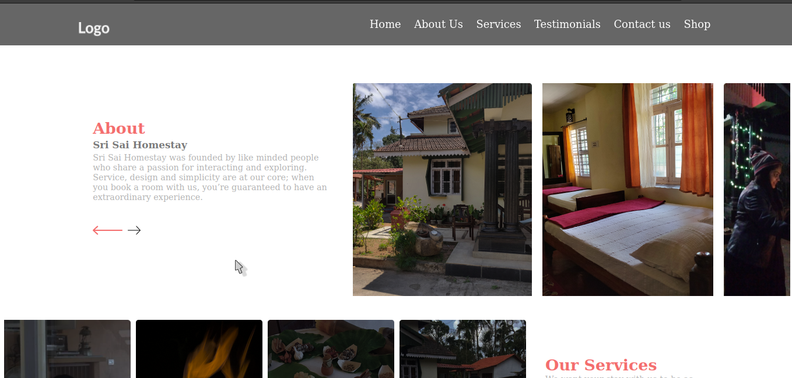
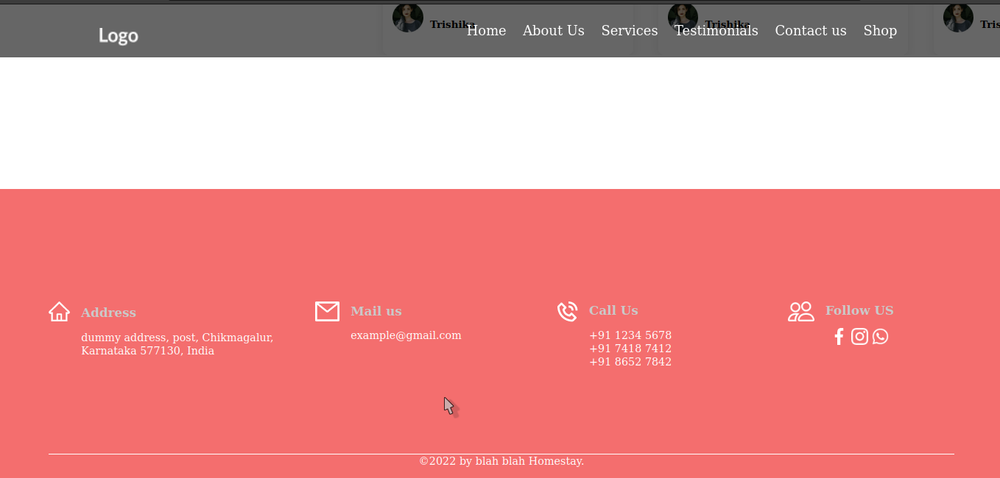
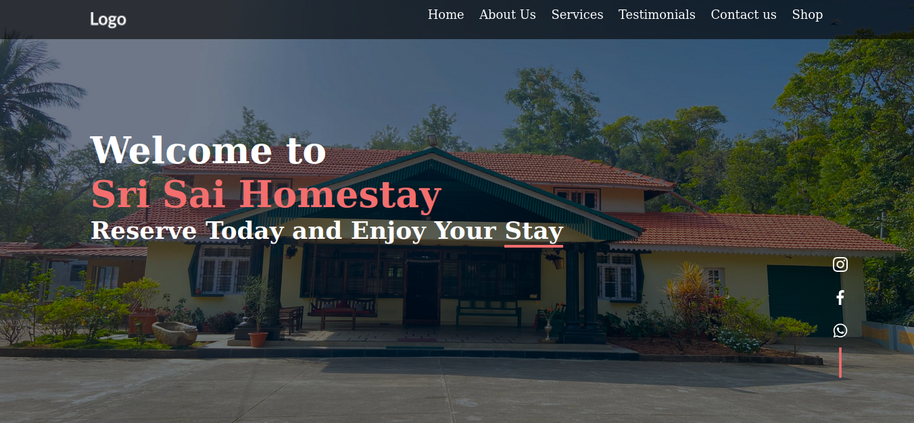
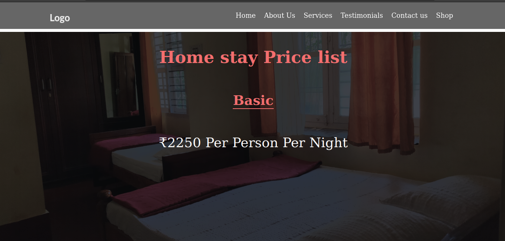
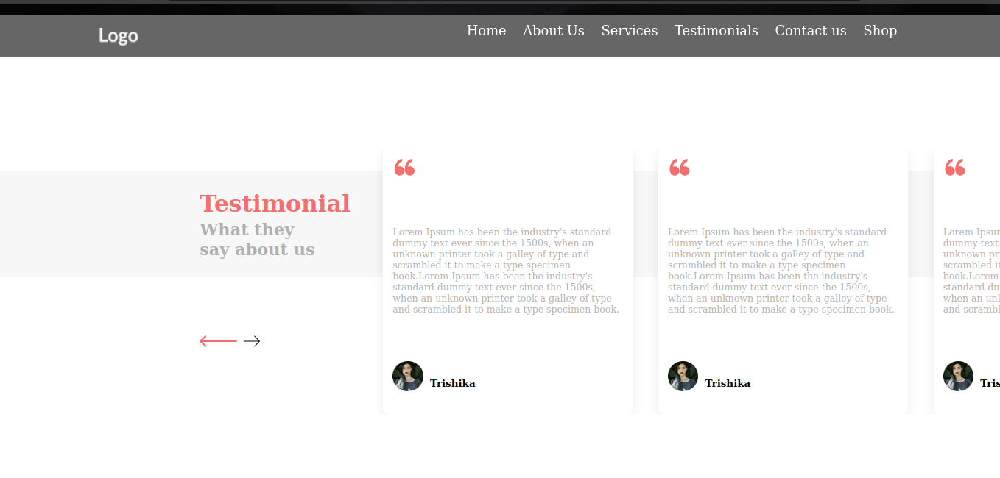

<!DOCTYPE html>
<html lang="en">
<head>
    <meta charset="UTF-8">
    <meta http-equiv="X-UA-Compatible" content="IE=edge">
    <meta name="viewport" content="width=device-width, initial-scale=1.0">
</head>
<body>
    <h1>Description: </h1>
The project shows the various features of the home stay with beautify UI

    <h1>Tools Used: </h1>
html, vanilla css, (no css framework used), java script

    <h1>github pages: </h1><a href="http://">Click here</a>
    <h1>Screenshots: </h1>
</body>
</html>

